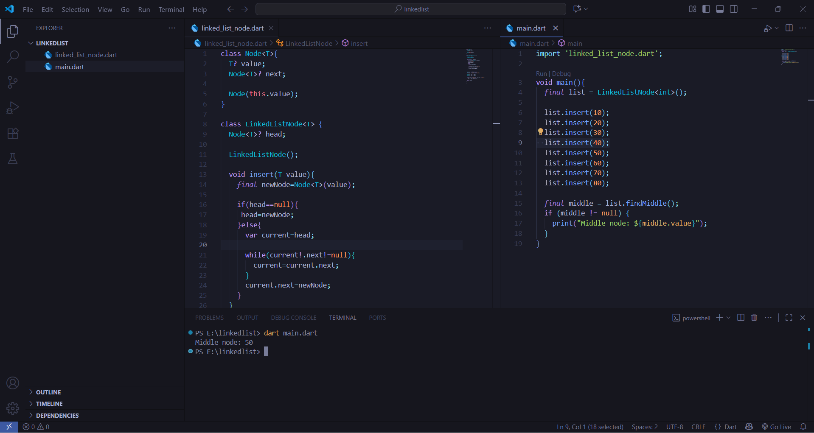
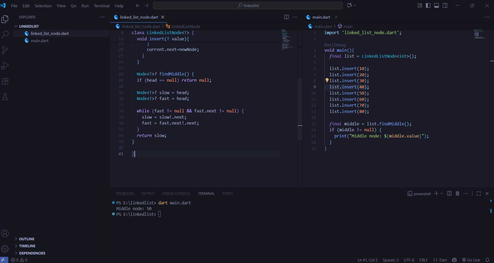

# linkedlist Implementation in Dart

This repository contains a simple generic **linkedlist** implementation in Dart.

---

## Features

- `insert()` → Add a node
- `findMiddle()` → Find the middle node from the linkedlist

# Screenshot







---

## Running Instructions


```bash
git clone https://github.com/ajlank/linkedlist-middle.git
cd linkedlist

in main.dart
---------------
final list = LinkedListNode<int>();

 list.insert(10);
 list.insert(20);
 list.insert(30);
 list.insert(40);
 list.insert(50);
 list.insert(60);
 list.insert(70);
 list.insert(80);
 

final middle = list.findMiddle();
print("Middle node: ${middle?.value}");


